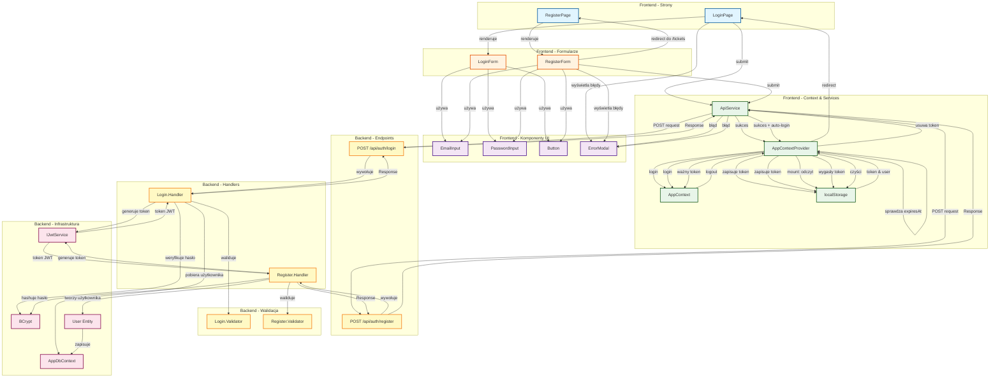

# Diagram Architektury Autentykacji - LottoTM

## Opis

Diagram przedstawia pełną architekturę systemu autentykacji w aplikacji LottoTM, obejmującą:
- Frontend (React) - strony, formularze, komponenty UI
- Context & Services - zarządzanie stanem i komunikacja z API
- Backend (.NET) - endpointy, handlery, walidacja
- Infrastruktura - JWT, BCrypt, baza danych

## Przepływy:

1. **Login Flow**: LoginPage → ApiService → Backend → JWT → AppContext → localStorage
2. **Register Flow**: RegisterPage → ApiService → Backend → BCrypt → DB → JWT → AppContext (auto-login)
3. **Session Restore**: localStorage → AppContext (sprawdzenie expiresAt)
4. **Logout Flow**: AppContext → localStorage (clear)

## Diagram Mermaid

## Legenda kolorów:

- **Niebieski** (page): Strony główne aplikacji
- **Pomarańczowy** (form): Formularze użytkownika
- **Fioletowy** (component): Komponenty UI współdzielone
- **Zielony** (service): Serwisy i Context
- **Żółty** (backend): Backend endpoints i handlers
- **Różowy** (infra): Infrastruktura (JWT, BCrypt, DB)

## Komponenty Frontend:

### Strony:
- **LoginPage**: Kontener logiki logowania, zarządza stanem formularza, obsługuje walidację i redirect
- **RegisterPage**: Kontener dla formularza rejestracji, nawigacja do logowania

### Formularze:
- **LoginForm**: Prezentacyjny komponent z polami email, hasło i przyciskiem submit
- **RegisterForm**: Zarządza rejestrację z walidacją inline (email, hasło, potwierdzenie), auto-login po sukcesie

### Komponenty UI:
- **EmailInput**: Input do wprowadzania adresu email
- **PasswordInput**: Input do wprowadzania hasła
- **Button**: Przycisk akcji (submit, cancel itp.)
- **ErrorModal**: Modal wyświetlający błędy walidacji i błędy API

### Context & Services:
- **AppContext**: Context React z interfejsem użytkownika i funkcjami auth
- **AppContextProvider**: Provider zarządzający stanem użytkownika (login, logout, session restore)
- **ApiService**: Centralna klasa HTTP komunikacji z backend API
- **localStorage**: Przechowywanie tokenu JWT i danych użytkownika

## Komponenty Backend:

### Endpoints:
- **POST /api/auth/login**: Publiczny endpoint logowania (AllowAnonymous)
- **POST /api/auth/register**: Publiczny endpoint rejestracji (AllowAnonymous)

### Handlers (MediatR):
- **Login.Handler**: Walidacja credentials, weryfikacja BCrypt, generowanie JWT
- **Register.Handler**: Walidacja danych, hashowanie BCrypt, zapis do DB, generowanie JWT

### Walidacja (FluentValidation):
- **Login.Validator**: Walidacja request logowania
- **Register.Validator**: Walidacja request rejestracji (wymagania hasła, unikalność email)

### Infrastruktura:
- **IJwtService**: Serwis generowania i walidacji tokenów JWT
- **BCrypt**: Hashowanie i weryfikacja haseł (10 rounds, timing attack protection)
- **AppDbContext**: Entity Framework DbContext dla dostępu do bazy SQL Server
- **User Entity**: Model użytkownika w bazie danych

## Bezpieczeństwo:

- **BCrypt hashing**: 10 rounds dla bezpiecznego przechowywania haseł
- **JWT tokens**: Bearer authentication z expiresAt
- **Timing attack protection**: Dummy hash verification w Login.Handler
- **Token persistence**: localStorage z automatycznym sprawdzeniem wygaśnięcia
- **FluentValidation**: Walidacja po stronie backendu
- **Frontend validation**: Regex email, wymagania hasła (min 8 znaków, wielka litera, cyfra, znak specjalny)

## Obsługa błędów:

- **400 Bad Request**: Błędy walidacji (frontend i backend)
- **401 Unauthorized**: Nieprawidłowe credentials
- **500 Internal Server Error**: Błędy serwera
- **ErrorModal**: Wyświetlanie błędów użytkownikowi
